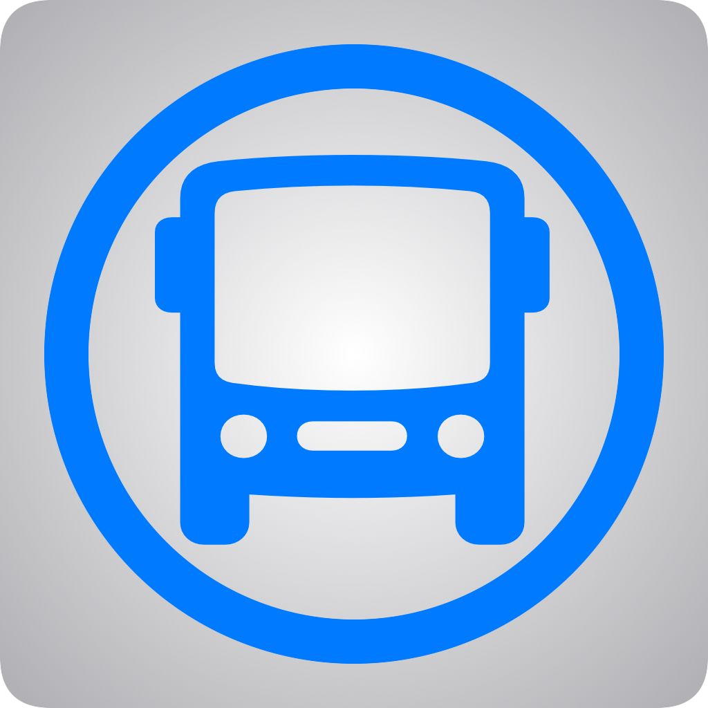
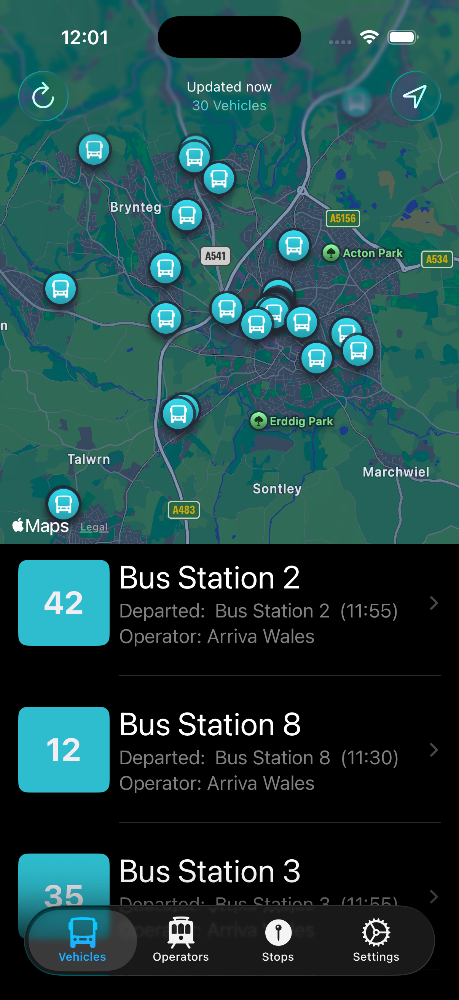
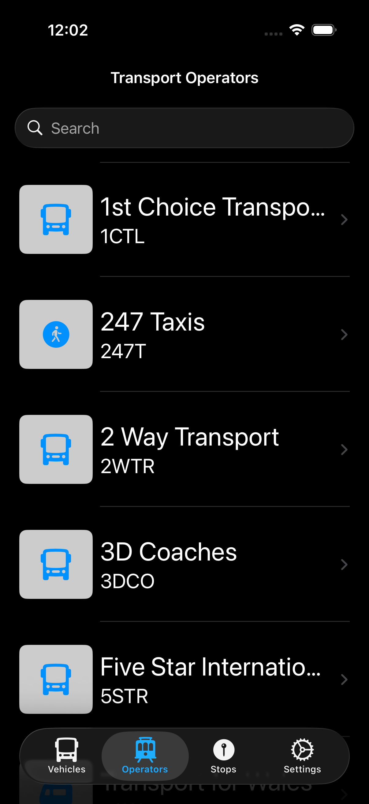
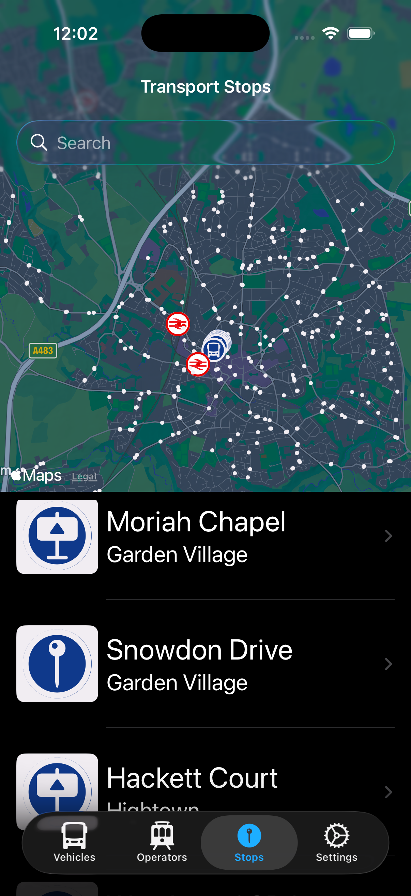
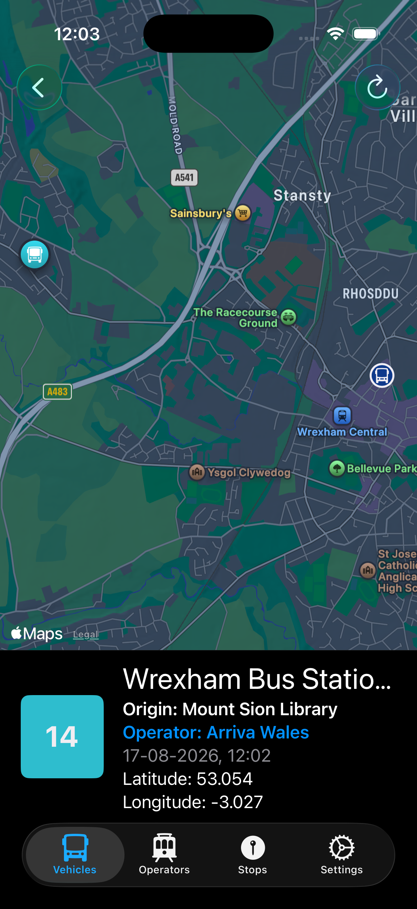
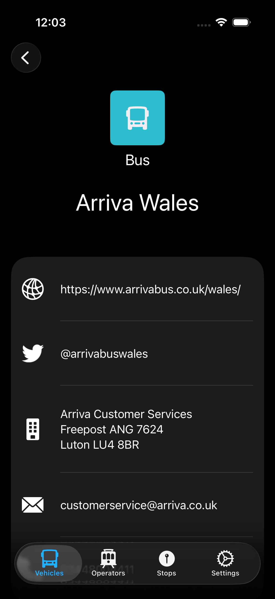
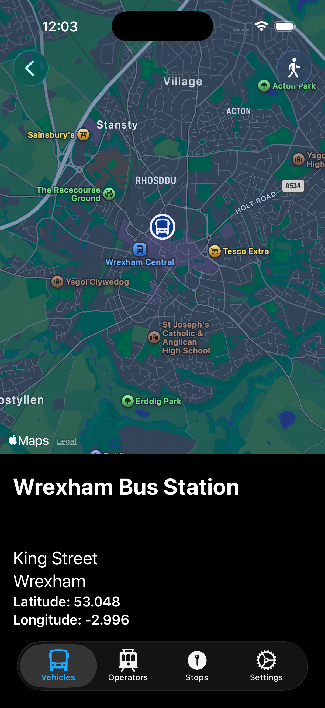

<link href="style.css" rel="stylesheet"></link>

# BusTracker App

[![iOS][ios-badge]][ios]
[![App Store][app-store-badge]][app-store]
[![Swift][swift-badge]][swift]
[![GitHub][github-badge]][github]
[![JSON][json-badge]](#)
[![XML][xml-badge]](#)
[![GitHub Issues][github-issues-badge]][github-issues]
[![Buy Me A Coffee][buy-me-a-coffee-badge]][buy-me-a-coffee]
[![License: MIT][license-badge]][license]
[![No AI][noai-badge]](#)

This is a bus tracking app for UK Bus services using location data from
the [Bus Open Data Service][bus-data-dft]
This app aims to provide users with real-time location data for buses across the UK.

_Main view showing buses around Cardiff, UK_

_View showing list of transport operators_

_View showing stops and stations around Cardiff, UK_

The app can be used to find bus services currently running, information about transport operators, and
the locations of bus stops and other transport access locations.

## Data Sources

- Bus location data: [Bus Open Data Service API][bus-data-dft]
- Transport operator data: [NOC Database][noc-database]
- Transport Stop data: [National Public Transport Access Nodes API][naptan-api]

## Dependencies

- [Open Bus API][open-bus-api]: Data access
- [XMLCoder library][xmlcoder]: Decoding location data
- [Octokit.Swift][octokit-swift]: GitHub interactions

The Bus location data is in XML format using the [SIRI-VM][siri-vm] standard.

## Using the App

The main view shows a list of vehicles with their current location displayed on the map (see above).
Each item in the list displays the bus number, its destination, where it departed from and at what time, and
the operator.

Clicking on an item in the bus list directs the user to a more detailed view about a particular bus (see below).
This includes its current location and the location of its destination.
More detailed information is provided about its location, origin, and when the information was obtained.

_View showing details of a bus in Cardiff, UK_

_View showing transport operator details_

_View showing details of a UK bus station_

The bus detail view includes a link to details about the bus operator including their website, contact information,
and social media (see above).

The operators tab (see top) includes a searchable list of all UK transport operators with links to the same detail
view as previously mentioned.

The stops tab provides a view of transport stops in the area and their location annotated by type (see top).
Clicking a stop from the list provides a more detailed view of the stop's location.

A settings tab is also included to adjust default settings (this is not advised) and provides information and links.

## Acknowledgements

I would like to thank the UK's public transport system for helping me conceive this app.
If I had never missed a bus which left early and had to wait half an hour for another,
I would never have made this app.

Thank you to anyone who has used the app. If you have any suggestions, issues, bugs, or notes, please report them in the
[issues tab][github-issues].
these may also be added through the app.
If you found the app use, please consider supporting my work:

[][buy-me-a-coffee]

<!--Links-->

[ios]: https://apple.com/ios/
[app-store]: https://appstore.com/
[swift]: https://www.swift.org
[github]: https://github.com/zwill22/BusTracker
[xmlcoder]: https://github.com/CoreOffice/XMLCoder
[github-issues]: https://github.com/zwill22/BusTracker/issues
[buy-me-a-coffee]: https://coff.ee/zmwill
[license]: https://github.com/zwill22/bustracker/blob/main/LICENSE
[bus-data-dft]: https://www.bus-data.dft.gov.uk
[noc-database]: https://www.travelinedata.org.uk/traveline-open-data/transport-operations/about-2/
[naptan-api]: https://naptan.api.dft.gov.uk/
[open-bus-api]: https://github.com/zwill22/OpenBusAPI
[octokit-swift]: https://github.com/nerdishbynature/octokit.swift
[siri-vm]: https://www.gov.uk/government/publications/technical-guidance-publishing-location-data-using-the-bus-open-data-service-siri-vm
<!-- Badges -->

[ios-badge]: https://img.shields.io/badge/iOS-000000?&logo=apple&logoColor=white&style=for-the-badge
[app-store-badge]: https://img.shields.io/badge/App_Store-0D96F6?logo=app-store&logoColor=white&style=for-the-badge
[swift-badge]: https://img.shields.io/badge/Swift-F54A2A?logo=swift&logoColor=white&style=for-the-badge
[github-badge]: https://img.shields.io/badge/GitHub-%23121011.svg?logo=github&logoColor=white&style=for-the-badge
[json-badge]: https://img.shields.io/badge/JSON-000?logo=json&logoColor=fff&style=for-the-badge
[xml-badge]: https://img.shields.io/badge/XML-767C52?logo=xml&logoColor=fff&style=for-the-badge
[github-issues-badge]: https://img.shields.io/github/issues/zwill22/BusTracker?style=for-the-badge&logo=github&label=Issues
[buy-me-a-coffee-badge]: https://img.shields.io/badge/Buy%20Me%20a%20Coffee-ffdd00?&logo=buy-me-a-coffee&logoColor=black&style=for-the-badge
[license-badge]: https://img.shields.io/github/license/zwill22/bustracker?style=for-the-badge
[noai-badge]: https://custom-icon-badges.demolab.com/badge/No%20AI-2f2f2f?logo=non-ai&logoColor=white&style=for-the-badge
